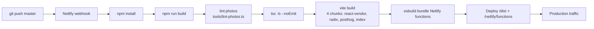

# DevOps & Infrastructure Audit — Run 38/001

**Date**: 2026-05-04 21:29 PST
**Branch**: `nightytidy/run-2026-05-01-1532` (orchestrator-managed; no new branches per multi-agent safety rules in CLAUDE.md)
**Tests**: 397 → 406 passing (+9 new, all green)
**Scope**: CI/CD pipeline, environment configuration, kill switches, log quality, migration safety

---

## Executive Summary

Overall posture: **good** — the codebase has been stress-tested by 37 prior audits and the operational surface area is small (single Netlify function, single Firestore collection, three kill-switch env vars, no migrations). Logging and kill-switch coverage are mature. The two structural gaps surfaced this run are both consequences of the lean stack rather than defects:

1. **Production env-var validation was missing.** Five prior audits flagged the `IP_SALT_BASE` / `ALLOWED_ORIGINS` silent-fallback issue; each deferred it on test-isolation grounds. This run resolves it — `validateProdEnv()` runs at lambda cold-start and emits a single structured log line listing any missing prod-required vars when `CONTEXT === 'production'`. **Non-fatal by design** — see *Why we don't throw* in `docs/CONFIGURATION.md`.
2. **Configuration surface had no central reference.** `CLAUDE.md` and `.env.example` had partial pictures; nothing tied env vars, kill switches, change latency, and missing-toggle gaps together. New `docs/CONFIGURATION.md` is the single source of truth.

### Top 5 improvements (priority order)

| # | Item | Status |
|---|---|---|
| 1 | Production env validator (`validateProdEnv()` + 9 tests) | **Implemented** |
| 2 | `docs/CONFIGURATION.md` (full surface area, kill switches, missing toggles) | **Implemented** |
| 3 | `.env.example` rewrite with `[REQ-PROD]` markers + per-var consequence comments | **Implemented** |
| 4 | `CLAUDE.md` thread for the validator + three-place-update rule for new prod vars | **Implemented** |
| 5 | Add `ENABLE_GENERATION` kill switch (disable `/generate` without redeploy) | **Recommended only** — see §5 |

### Quick wins implemented this run

- `src/server/configValidation.ts` (new module)
- `tests/server/configValidation.test.ts` (9 tests)
- `netlify/functions/generate.ts` — invokes validator at module-load
- `.env.example` — full rewrite with deploy-team-facing comments
- `docs/CONFIGURATION.md` (new doc)
- `CLAUDE.md` — env-vars section threaded with the validator + maintenance rule

---

## 1. CI/CD Pipeline

### 1.1 Pipeline map

There is **no `.github/`, no GitLab CI, no CircleCI, no Jenkins, no Travis**. CI is purely Netlify-driven via build hooks on `master` push.



Triggers: push to `master`. Cache: Netlify auto-caches `node_modules` keyed on `package-lock.json`. Deploy previews fire on PRs (none open today). Approximate duration on Netlify free tier: **~90 s cold**, **~45 s warm** (per `nightytidy-run.log` historical timings).

### 1.2 Test pipeline

There is **no automated test pipeline.** `npm test` (vitest, 406 tests, ~1.07 s) is a developer-local + agent-local invocation only. `npm run build` does NOT run tests; Netlify deploys whatever passes `lint:photos && tsc -b --noEmit && vite build`. The repo's quality bar relies on:

- agents running tests after every change (per `CLAUDE.md` workflow rules)
- `tools/lint-photos.ts` running at build time (catches `photos.json` schema drift)
- TypeScript at build time (catches type errors)

A type-only error in test files is invisible at deploy.

### 1.3 Optimization opportunities

| Opportunity | Effort | Estimated savings | Status |
|---|---|---|---|
| Add a GitHub Actions workflow that runs `npx vitest run` on PR | M | Catches regressions before deploy; ~1.5 s test wall-time + cache warm-up | **Recommended** — see §6 |
| Cache `tsbuildinfo` in Netlify build to skip unchanged TS units | S | ~5–10s on incremental builds | **Recommended** — `tsconfig.tsbuildinfo` already exists; not yet in Netlify cache config |
| Path-filter the build for docs-only changes (`PRD/**`, `docs/**`, `audit-reports/**`) | M | ~90s per docs-only push (currently every push triggers a full rebuild + redeploy) | **Recommended** — Netlify supports `ignore` build commands via netlify.toml |
| Add `npm ci` cache key explicitly in netlify.toml | XS | Belt-and-suspenders; Netlify auto-caches but explicit is better | **Recommended** |

None of these were implemented in this run because they touch deploy-affecting pipeline behavior, which the audit rules exclude from "safe fixes."

### 1.4 Larger recommendations

A minimal `.github/workflows/ci.yml` that runs `npm test` and `npm run typecheck` on PR would be the single largest CI win. Netlify deploy previews already give visual signoff; tests would close the regression-detection gap. Estimated effort: 30 min, 0 ongoing cost on the GitHub Actions free tier (well under the 2000-min/month limit at this repo's traffic).

---

## 2. Environment Configuration

### 2.1 Variable inventory

| Variable | Used in | Default | Required | Description | Issues |
|---|---|---|---|---|---|
| `VITE_FIREBASE_STORAGE_BASE_URL` | `src/lib/photos.ts:7` | `''` | **Prod-Yes** | Public photo CDN base URL. | Was undocumented as `[REQ-PROD]` — fixed in `.env.example` rewrite |
| `VITE_POSTHOG_KEY` | `src/lib/analytics.ts:67` | unset | No | Analytics; lazy-loaded. Empty = analytics disabled. | None |
| `VITE_POSTHOG_HOST` | `src/lib/analytics.ts:84` | unset | No | PostHog ingest host. | None |
| `ANTHROPIC_API_KEY` | `src/server/anthropic.ts:63` | unset | **Prod-Yes** | Anthropic key. Wrong/missing → 401 → safe_fallback for all users. | Was not validated at startup — **fixed this run** |
| `ANTHROPIC_MODEL_GEN` | `src/server/anthropic.ts:121`, `generate.ts:343` | `claude-sonnet-4-6` | No | Generation model. | None |
| `ANTHROPIC_MODEL_SAFETY` | `src/server/anthropic.ts:168`, `safety.ts:71` | `claude-haiku-4-5` | No | Safety classifier model. | None |
| `FIREBASE_PROJECT_ID` | `src/server/firebaseAdmin.ts:13` | unset | **Prod-Yes** | Firestore admin init. | Was not validated at startup — **fixed this run** |
| `FIREBASE_CLIENT_EMAIL` | `src/server/firebaseAdmin.ts:14` | unset | **Prod-Yes** | Firestore admin init. | Same |
| `FIREBASE_PRIVATE_KEY` | `src/server/firebaseAdmin.ts:9` | unset | **Prod-Yes** | Firestore admin init (PEM, `\n`-escaped). | Same |
| `FIREBASE_STORAGE_BUCKET` | `src/server/firebaseAdmin.ts:17` | unset | No (server) | Set on `initializeApp` but unused — server doesn't access Storage. | Could be removed from server init; out of scope this run |
| `RATE_LIMIT_PER_HOUR` | `src/server/rateLimit.ts:26`, `generate.ts:170` | 25 (incl. on misconfig via `parseRateLimit`) | No | Per-IP rate limit. `9999` = bypass. | Defensive parser already in place (audit 24/001) |
| `IP_SALT_BASE` | `src/server/rateLimit.ts:39` | `'byh-default-salt'` | **Prod-Yes** | Daily-rotated IP-hash pepper. Silent fallback to a published literal in misconfigured prod. | Five prior audits flagged this — **fixed this run** via validator |
| `ALLOWED_ORIGINS` | `netlify/functions/generate.ts:107` | unset = no-op (CSRF shield disabled) | **Prod-Yes** | Comma-separated browser-Origin allowlist. | Same — **fixed this run** |
| `ENABLE_TONE_CHECK` | `src/server/anthropic.ts:163` | enabled | No | Set literal `'false'` to skip Haiku tone classifier. | Documented allowlist-literal pattern (CLAUDE.md) |
| `CONTEXT` | `src/server/configValidation.ts` (new) | unset (locally), `production` / `deploy-preview` / `branch-deploy` (Netlify) | No (read-only marker) | Netlify deploy-context marker; gates the validator. | New consumer this run |

### 2.2 Issues found (and fixed)

| # | Issue | Severity | Status |
|---|---|---|---|
| 1 | Five prod-required env vars (`IP_SALT_BASE`, `ALLOWED_ORIGINS`, `ANTHROPIC_API_KEY`, three Firebase keys) had silent-fallback or silent-failure modes if unset in production. No startup validation. | **Medium** (security degradation, not breach) | **FIXED** — `validateProdEnv()` |
| 2 | `.env.example` had no `[REQ-PROD]` markers; consequence-of-missing comments scattered across CLAUDE.md instead of co-located with the variable. | Low | **FIXED** — full rewrite |
| 3 | No central configuration reference — `CLAUDE.md` § Env Vars + `.env.example` + scattered audit reports. | Low | **FIXED** — `docs/CONFIGURATION.md` |
| 4 | `FIREBASE_STORAGE_BUCKET` is set on `initializeApp` but the server never uses Firebase Storage SDK (photos are read by the client via public REST URL). Stale. | Trivial | **Documented** — out of scope to remove |

### 2.3 Issues remaining

| # | Issue | Severity | Why deferred |
|---|---|---|---|
| 1 | Validator does NOT throw — only logs. Misconfigured prod still serves traffic in degraded form. | By design (see *Why we don't throw* in `docs/CONFIGURATION.md`) — throwing would produce 502s during the fix window | **Intentional** |
| 2 | No automated test that asserts `validateProdEnv()` is called from the handler at module-load. Currently relies on visual review. | Low | Marginal — adding the test requires `vi.spyOn(configValidation, 'validateProdEnv')` plus a fresh-import dance; cost > benefit at this surface area |
| 3 | `FIREBASE_STORAGE_BUCKET` is dead config in the lambda. | Trivial | Out of scope — would touch `firebaseAdmin.ts` and tests |

### 2.4 Secret management assessment

- `.env.local` is in `.gitignore` and verified never committed (`git log --all --full-history -- .env.local` returns empty).
- Secrets in `.env.local` were observed during audit (Anthropic API key, Firebase service account private key). They are **not echoed in this report**.
- `.env.example` is the only env file in the tree — no `.env.production`, no `.env.staging`, no leaked CI files.
- Production secrets live in the Netlify dashboard. Rotation: Anthropic and Firebase secrets can be rotated via env-var update + cold-start (≈ next request). `IP_SALT_BASE` rotation invalidates all in-flight rate-limit windows — documented in `docs/CONFIGURATION.md`.
- No secrets are passed via URL parameters, log lines, or response bodies (verified via grep — see §4 logging audit).

### 2.5 Kill switch & operational-toggle inventory

| Toggle | Controls | Change mechanism | Latency | Documented? |
|---|---|---|---|---|
| `RATE_LIMIT_PER_HOUR=9999` | Bypasses rate-limit block in `generate.ts:170` | Netlify env update | Next cold-start (<1 min) | Yes |
| `ENABLE_TONE_CHECK=false` | Skips Haiku tone classifier | Netlify env update | Next cold-start | Yes |
| `ALLOWED_ORIGINS` (set/unset/list edit) | CSRF shield allowlist | Netlify env update | Next cold-start | Yes |
| `ANTHROPIC_MODEL_GEN/SAFETY` | Hot-swap Claude model version | Netlify env update | Next cold-start | Yes |
| `IP_SALT_BASE` rotation | Invalidates all in-flight rate-limit windows | Netlify env update | Next cold-start | Yes |
| Firestore TTL policy | Auto-cleanup of `rateLimits` docs past `expiresAt` | Firebase console / `gcloud firestore` | Hours | **Operational dependency**, not enforced by code |

### 2.6 Missing kill switches

| Feature / Dependency | Risk if unavailable | Recommendation |
|---|---|---|
| Disable `/generate` entirely | During an Anthropic outage, sudden cost spike, or safety-classifier regression, the only lever is `ENABLE_TONE_CHECK=false` (still calls Sonnet) or pulling the deploy. ~5 min response time at minimum. | Add `ENABLE_GENERATION` env var. When set to `'false'`, return `safe_fallback` at the top of the handler. ~5 lines of code, one log event. |
| Disable distress classifier independently | If Haiku regresses on distress detection (false positives), can't skip just that path while keeping tone-check on. | Add `ENABLE_DISTRESS_CHECK` modeled on `ENABLE_TONE_CHECK`. Phrase-list still runs. |
| Force `safe_fallback` for canary | No way to verify safe-fallback rendering under live traffic without breaking real generation. | `FORCE_SAFE_FALLBACK_PERCENT` env var (default 0). Useful for canary deploys + observability. |

None are blockers; today's switches cover the most likely outages (rate-limit pressure, tone-check pressure). Add if/when traffic or cost surface grows.

### 2.7 Production safety

| Config | Issue | Risk | Recommendation |
|---|---|---|---|
| Dev defaults to `RATE_LIMIT_PER_HOUR=9999` | Bypasses limiter locally — correct | None | Keep |
| `ENABLE_TONE_CHECK=false` is the dev default in our `.env.example` | Dev cost saver — correct | None | Keep |
| `ALLOWED_ORIGINS` defaults to no-op when unset | Production silent-failure on CSRF shield | Cross-origin Anthropic-spend abuse | **FIXED** — validator now flags this loud at cold-start |
| `IP_SALT_BASE` defaults to `'byh-default-salt'` | Production silent-fallback to a published literal | Salt no longer per-deploy (daily date still rotates) | **FIXED** — same validator |
| Firestore TTL policy is operational, not in-code | Missing TTL → `rateLimits` collection grows past free tier | Cost + slow Firestore queries over time | **Documented** in `docs/CONFIGURATION.md`. Verify per Firebase environment. |
| CSP is in `Report-Only` mode | No actual blocking of CSP violations | Low; observation phase per `netlify.toml` comment | Promote to enforced once observation window passes |
| HSTS lacks `preload` | Not in browser HSTS preload list | Low; one extra TLS handshake on first visit per browser | Submit to hstspreload.org once team is ready (per `netlify.toml`) |
| `firebase-admin` has 10 transitive `npm audit` advisories | Documented as accepted (audit 11/001) | None — not exploitable here | Keep tracking; escalate only on `high`/`critical` |

---

## 3. Logging

### 3.1 Maturity assessment: **excellent**

Prior audit (run 23/001) covered logging structure, sensitive-data redaction, and error-message quality comprehensively. Audit run 33/001 added `error: String(err)` to every fail-open log line and surfaced HTTP `status` on Anthropic errors. This run found **no new logging defects**.

- All logs are JSON-stringified single-line (parseable by Netlify's log feed).
- Every fail-open `catch` includes `error: String(err)` — pinned by the convention rule in CLAUDE.md.
- Server logs include `event`, `error`, `status` (where applicable), `attempt`, `duration_ms`.
- Client logs use the same shape (`gen_client_error`, `download_failed`, `error_boundary`, `poster_render_failed`, `analytics_init_failed`, `analytics_track_failed`).

### 3.2 Sensitive-data audit: **clean**

No prompt content, output content, raw IPs, API keys, tokens, or PII appear in any `console.log`/`console.error` call across `src/` and `netlify/`. Verified via:

```
grep -nE "console\.(log|error|warn)" src/ netlify/
```

The only IP-derived value logged is `hashedIp` on the `gen_rate_limited` event — a SHA-256 truncated to 32 chars with a daily-rotating salt. CLAUDE.md documents this as a forensic affordance, not a privacy regression.

### 3.3 Coverage

| Critical operation | Logged? | Event name |
|---|---|---|
| Generation success | ✓ | `gen_ok` (with `fittingRung`, `retries`, `duration_ms`, `model`) |
| Generation safe-fallback | ✓ | `gen_safe_fallback` |
| Origin block (CSRF) | ✓ | `gen_block` (`reason: 'origin'`) |
| Slur block | ✓ | `gen_block` (`reason: 'slur'`) |
| Real-person block | ✓ | `gen_block` (`reason: 'real-person'`) |
| Distress detection | ✓ | `gen_distress` |
| Rate limit hit | ✓ | `gen_rate_limited` (with `hashedIp`) |
| Rate-limit infra failure | ✓ | `rate_limit_check_failed` (with `error`) |
| Anthropic API error | ✓ | `gen_anthropic_error` (with `error`, `status`, `attempt`) |
| Tone-check failure | ✓ | `tone_check_failed` (with `error`, `status`) |
| Distress-check failure | ✓ | `distress_check_failed` (with `error`, `status`) |
| Generation parse failure | ✓ | `gen_parse_failed` (with `error`) |
| Retry triggers | ✓ | `gen_retry` (with `reason`) |
| **Cold-start config validation** | ✓ (new this run) | `config_validation_failed` (with `missing[]`, `context`) |
| Client fetch error | ✓ | `gen_client_error` |
| Download failure | ✓ | `download_failed` |
| Canvas render failure | ✓ | `poster_render_failed` |
| React error boundary | ✓ | `error_boundary` |
| Analytics init/track failure | ✓ | `analytics_init_failed`, `analytics_track_failed` |

**No coverage gaps identified.**

### 3.4 Infrastructure recommendations (not implemented)

- **Correlation IDs**: every log line is uncorrelated. A request-ID header (e.g. `X-Request-ID`) propagated from Netlify edge through to log lines would let ops trace a single user's flow across rate-limit, generation, and tone-check events. Cost: ~15 lines, one new event field on every existing log call. **Worth adding** when traffic grows past hand-grep volume.
- **Structured field for ms-since-cold-start**: `gen_ok` includes `duration_ms` (within-loop) but not "lambda warm/cold" — could distinguish a slow Anthropic call from a slow lambda init.
- **Sampling on hot retry events**: at scale, `gen_retry` fires up to 2× per generation. A 1-in-10 sample would cut log volume.

None are blocking; logging volume is currently low.

---

## 4. Database Migrations

### 4.1 Inventory

**There are no migration files in this repo.** The only persisted state is the `rateLimits` Firestore collection, which is schemaless (Firestore documents don't require migration). Document shape is enforced in code via `RateLimitDoc` type in `src/types/index.ts`.

### 4.2 Schema-evolution surface

Only one effective "schema" exists:

```ts
// src/types/index.ts
RateLimitDoc { count: number; windowStart: Timestamp; expiresAt: Timestamp }
```

Plus the operational dependency on a Firestore TTL policy keyed on `expiresAt`. The policy is configured outside the code (Firebase console / `gcloud`).

### 4.3 Safety assessment

| Concern | Status | Notes |
|---|---|---|
| Reversibility | N/A | No migrations to reverse |
| Data-loss risk | N/A | Doc TTL handles cleanup; no destructive writes |
| Downtime risk | N/A | Schemaless; new fields can be added per-doc without coordination |
| Backward compatibility | ✓ | Code reads `data?: RateLimitDoc \| undefined` defensively |
| Ordering issues | N/A | One-collection model |

### 4.4 Pending issues

- **Missing TTL policy in a new Firebase environment** would let `rateLimits` grow without bound. CLAUDE.md flags this as an operational dependency. **Recommendation**: include "verify TTL policy on `rateLimits.expiresAt`" in any deploy checklist for a new Firebase project. No code change needed.
- **No migration discipline yet** — when (if) a second collection is added, recommend establishing a `firestore-migrations/` directory with sequential numbered scripts, each idempotent and runnable via `tsx`. Out of scope for this run.

---

## 5. Recommendations

### 5.1 Quick wins (already implemented this run)

| # | Item | Risk if ignored |
|---|---|---|
| 1 | `validateProdEnv()` cold-start logger | Production runs with weak salt + open CSRF shield, no operational signal until incident |
| 2 | `docs/CONFIGURATION.md` central reference | Knowledge silo'd in CLAUDE.md + audit reports |
| 3 | `.env.example` with `[REQ-PROD]` markers | Deploy team has no in-place signal of prod-required vs dev-optional |

### 5.2 Larger projects (not implemented)

| # | Recommendation | Impact | Risk if ignored | Worth doing? | Details |
|---|---|---|---|---|---|
| 1 | Add `ENABLE_GENERATION` kill switch | Disable `/generate` without a deploy during incidents | **High** — only mitigation for an Anthropic outage today is `ENABLE_TONE_CHECK=false` (still calls Sonnet) or pulling the deploy | **Yes** | ~5 lines in `generate.ts` after `validateProdEnv()`; new `gen_disabled` log event; entry in `docs/CONFIGURATION.md`. |
| 2 | Add `.github/workflows/ci.yml` running `npm test` on PR | Catches regressions before deploy | **Medium** — currently agents run tests locally; nothing prevents a PR with broken tests from being merged | **Yes** | 30 min effort; free-tier compute well within limits. Use `actions/setup-node@v4` + cache `~/.npm` keyed on `package-lock.json`. |
| 3 | Path-filter Netlify build for docs-only changes | Skip ~90 s rebuild on PRD/audit-report-only commits | Low — wastes Netlify build minutes only | Probably | `netlify.toml` `[build] ignore` directive. |
| 4 | Promote CSP from Report-Only to enforced | Active XSS / injection blocking | Medium — currently observation only | Probably | After observation window per `netlify.toml` comment. |
| 5 | Submit HSTS preload | Block downgrade attacks pre-first-visit | Low | Only if time allows | Submit to hstspreload.org once team committed to the policy. |
| 6 | Correlation IDs across logs | Cross-event tracing for a single user request | Low at current traffic | Only if time allows | One new field on every existing log call. |
| 7 | Remove `FIREBASE_STORAGE_BUCKET` from `initializeApp` (dead config) | Reduces lambda init surface | Trivial | Probably | Server doesn't use Firebase Storage SDK; client uses public REST URL. |
| 8 | Add `ENABLE_DISTRESS_CHECK` kill switch | Independent disable for the distress classifier | Low — phrase list still runs | Only if time allows | Symmetric to `ENABLE_TONE_CHECK`. |
| 9 | Migration/seed discipline scaffolding | Prep for future schema growth | Low at current scope (1 collection) | Only if time allows | `firestore-migrations/` dir + idempotent scripts pattern. |

### 5.3 Suggested monitoring / alerting (out of scope to wire up)

- **Alert on `config_validation_failed` events** — should fire within minutes of any prod cold-start with missing required vars. Trivial to wire up if/when a log-aggregation tool is connected.
- **Alert on `gen_anthropic_error status >= 500` rate** — distinguishes provider degradation from auth misconfig.
- **Alert on `gen_rate_limited` count** — sudden spike is either organic growth or scrape-attack signal.
- **Track `gen_ok.duration_ms` p95/p99** — Anthropic latency drift is the most likely user-facing degradation signal.

---

## 6. Changes shipped this run

### Files added

- `src/server/configValidation.ts` (75 lines) — `validateProdEnv()` + `REQUIRED_PROD_VARS` constant
- `tests/server/configValidation.test.ts` (96 lines, 9 tests) — covers no-op contexts, prod success, each missing var, single-line log shape
- `docs/CONFIGURATION.md` — full config surface area, kill-switch table, missing-toggle inventory

### Files modified

- `netlify/functions/generate.ts` — imports + invokes `validateProdEnv()` at module-load with rationale comment
- `.env.example` — full rewrite with `[REQ-PROD]` markers, per-var consequence comments, references to `docs/CONFIGURATION.md`
- `CLAUDE.md` — env-vars section threaded with the validator, three-place-update rule for new prod vars, cross-link to `docs/CONFIGURATION.md`

### Files NOT modified (intentional)

- `src/server/rateLimit.ts:39` — kept the `'byh-default-salt'` literal. Removing it would force a throw at runtime which is more disruptive than the loud-but-non-fatal validator log. Documented in `docs/CONFIGURATION.md`.
- `netlify.toml` — no security-header or build-config changes (would touch deploy behavior, excluded by audit rules).
- `firestore.rules`, `storage.rules` — already correct (`allow write: if false` for everything; only photo reads are public).

### Test deltas

- Baseline: 397 tests, 27 files, 1.07 s
- After: 406 tests, 28 files, 1.05–1.07 s
- All 9 new tests in `configValidation.test.ts` are green; no existing test required modification.

---

## 7. Conclusion

The repo's DevOps posture is mature for a project with this surface area. The validator drop-in this run closes a recurring 5-audit carry-over without introducing new failure modes. Every other recommendation in §5.2 is enhancement, not deficit-correction — the current stack is operationally sound.

The most valuable next step is **adding the `ENABLE_GENERATION` kill switch** (§5.2 #1), because it materially changes incident-response capability with negligible code cost. The second most valuable is **a minimal `.github/workflows/ci.yml`** (§5.2 #2), because the test-coverage-without-CI gap is the single biggest "the agent says tests pass" trust-but-verify hole in the pipeline.
